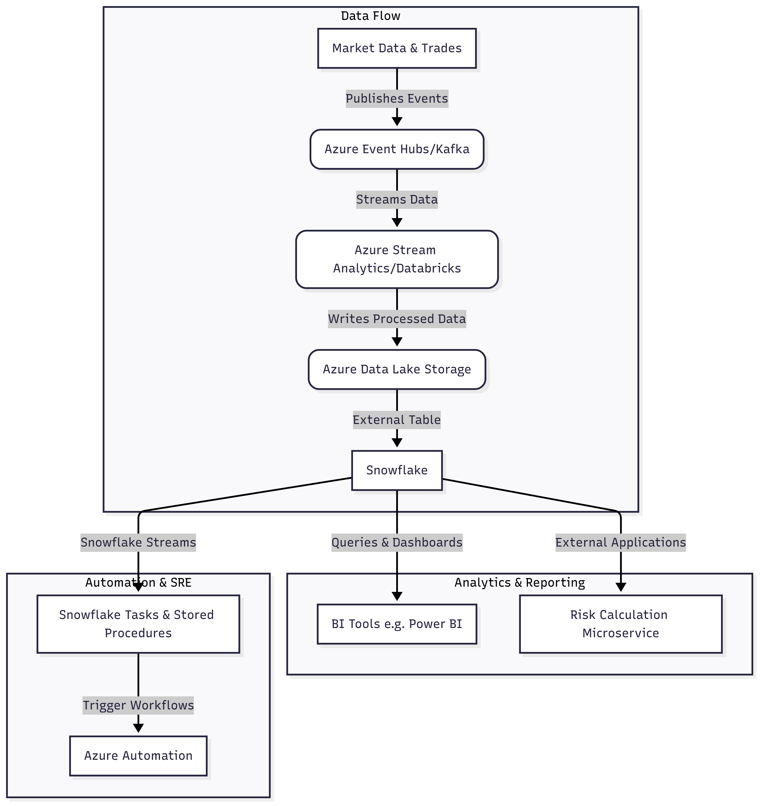
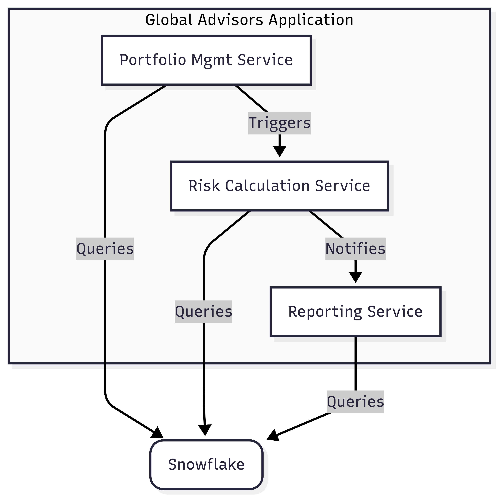
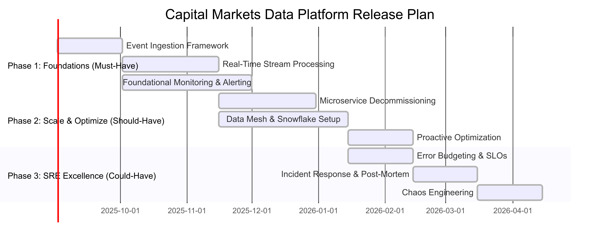
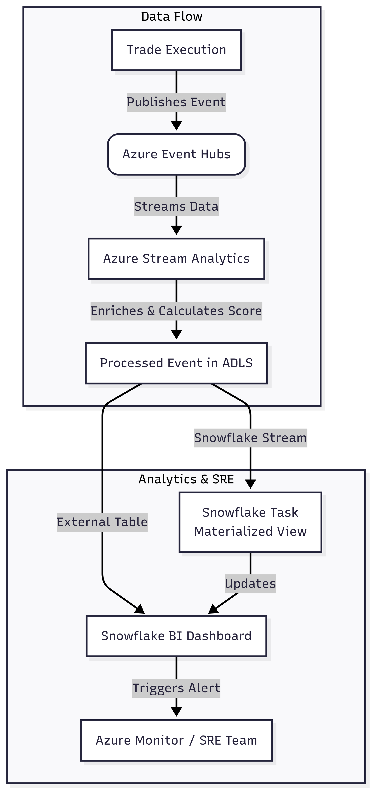

# **Capital Markets Data Platform: Architecture & SRE Roadmap**

## **1\. Summary**

This document outlines a modern, scalable, and resilient data platform architecture for a capital markets firm. The design follows a federated, event-driven model to enable real-time analytics and support global business units. The architecture is complemented by a Site Reliability Engineering (SRE) framework focused on proactive monitoring, automation, and continuous improvement to ensure reliability and cost-efficiency.

## **2\. Foundational Architecture**

The core of the platform is an Event-Driven Architecture (EDA) that leverages Snowflake for analytical workloads.

### **2.1. System Flow & Components**

The following diagram illustrates the flow of a trade event through the platform.

Code snippet

graph TD
    subgraph Data Flow
        Source[Market Data & Trades] --> |Publishes Events| EventHubs(Azure Event Hubs/Kafka)
        EventHubs --> |Streams Data| StreamProcessor(Azure Stream Analytics/Databricks)
        StreamProcessor --> |Writes Processed Data| ADLS(Azure Data Lake Storage)
        ADLS --> |External Table| SnowflakeDB[Snowflake]
    end

    subgraph Analytics & Reporting
        SnowflakeDB --> |Queries & Dashboards| BI_Tools[BI Tools e.g. Power BI]
        SnowflakeDB --> |External Applications| Microservices[Risk Calculation Microservice]
    end

    subgraph Automation & SRE
        SnowflakeDB --> |Snowflake Streams| SnowflakeTasks[Snowflake Tasks & Stored Procedures]
        SnowflakeTasks --> |Trigger Workflows| Automation[Azure Automation]
    end

### **2.2. Core Technology Stack**

* **Event Ingestion:** **Azure Event Hubs** or **Apache Kafka** to handle high-throughput, real-time data streams.  
* **Stream Processing:** **Azure Stream Analytics** for simple, low-latency transformations or **Databricks** for complex, stateful analytics.  
* **Event Storage:** **Azure Data Lake Storage (ADLS)** as the data lake, with data stored in optimized formats like Parquet.  
* **Analytics & Warehouse:** **Snowflake**, using **External Tables** for historical data and standard tables for processed data.

## **3\. Distributed Architecture & Data Mesh**

Our approach moves beyond a monolithic structure to a decentralized, distributed architecture.

### **3.1. Microservices & Interoperability**

Microservices are deployed on **Azure Kubernetes Service (AKS)**, ensuring they are independent and scalable.

Code snippet

graph TD  
    subgraph Global Advisors Application  
        A\[Portfolio Mgmt Service\]  
        B\[Risk Calculation Service\]  
        C\[Reporting Service\]  
    end  
    DB(Snowflake)  
    A--Queries--\>DB  
    B--Queries--\>DB  
    C--Queries--\>DB  
    A--Triggers--\>B  
    B--Notifies--\>C

### **3.2. Data Mesh & Federated Governance**

* **Domain Ownership:** Data ownership is decentralized to business domains (e.g., "Equity Trading").  
* **Data as a Product:** Each domain team is responsible for creating, curating, and sharing their data as a product via a central data catalog.  
* **Hybrid Cloud Integration:** **Azure Arc** extends Azure governance to our on-premises and multi-cloud environments, ensuring consistency across deployments.

## **4\. Continuous Improvement & SRE Framework**

### **4.1. Monitoring & Alerting**

* **Tools:** **Snowflake System Functions** (QUERY\_HISTORY, WAREHOUSE\_LOAD\_HISTORY) and **Azure Monitor** for a unified observability platform.  
* **Metrics:** Monitor query latency, warehouse utilization, and storage costs.  
* **Alerts:** **Azure Alerts** and **Snowflake Event Notifications** for anomalies.

### **4.2. Optimization & Cost Management**

* **Query Optimization:** Regular analysis of **Query Profiles** to identify and fix bottlenecks.  
* **Data Structures:** Implement **Search Optimization Service** for specific queries and **materialized views** for frequently accessed data.  
* **Cost Control:** Use **Snowflake Resource Monitors** and **Azure Cost Management** to enforce budgets and optimize spending.

## **5\. Agile Features & Release Plan**

This is a prioritized agile roadmap. Each feature is a user story that can be broken down into specific tasks.

### **5.1. Features & Prioritization**

code snip
gantt
    dateFormat  YYYY-MM-DD
    title Capital Markets Data Platform Release Plan

    section Phase 1: Foundations (Must-Have)
    Event Ingestion Framework :a1, 2025-09-02, 30d
    Real-Time Stream Processing :a2, after a1, 45d
    Foundational Monitoring & Alerting :a3, after a1, 60d

    section Phase 2: Scale & Optimize (Should-Have)
    Microservice Decommissioning :b1, after a2, 45d
    Data Mesh & Snowflake Setup :b2, after a2, 60d
    Proactive Optimization :b3, after b2, 30d

    section Phase 3: SRE Excellence (Could-Have)
    Error Budgeting & SLOs :c1, after b2, 30d
    Incident Response & Post-Mortem :c2, after b3, 30d
    Chaos Engineering :c3, after c2, 30d

* **Phase 1: Foundations (Must-Have)**  
  * **Feature:** Event Ingestion Framework  
  * **Feature:** Real-Time Stream Processing  
  * **Feature:** Foundational Monitoring & Alerting  
* **Phase 2: Scale & Optimize (Should-Have)**  
  * **Feature:** Microservice Decommissioning  
  * **Feature:** Data Mesh & Snowflake Setup  
  * **Feature:** Proactive Optimization  
* **Phase 3: SRE Excellence (Could-Have)**  
  * **Feature:** Error Budgeting & SLOs  
  * **Feature:** Incident Response & Post-Mortem  
  * **Feature:** Chaos Engineering

## **6\. Case Example: Real-Time Trade Analytics**

### **6.1. The Challenge**

A global advisory firm needs to see the real-time impact of trades on a portfolio's risk exposure. The current nightly batch process is too slow.

### **6.2. The Solution Flow**

code snip
graph TD
    A[Trade Execution] -- Publishes Event --> B(Azure Event Hubs)
    B -- Streams Data --> C[Azure Stream Analytics]
    C -- Enriches & Calculates Score --> D[Processed Event in ADLS]
    D -- External Table --> E[Snowflake BI Dashboard]
    D -- Snowflake Stream --> F[Snowflake Task Materialized View]
    F -- Updates --> E
    E -- Triggers Alert --> G[Azure Monitor / SRE Team]

    subgraph Data Flow
        A
        B
        C
        D
    end

    subgraph Analytics & SRE
        E
        F
        G
    end

1. **Ingestion:** A trade is executed and published as an event to Azure Event Hubs.  
2. **Processing:** An Azure Stream Analytics job consumes the event, enriches it with portfolio metadata from a reference table, and calculates a preliminary risk score.  
3. **Storage:** The processed event is written as a Parquet file to ADLS.  
4. **Analytics:** A BI dashboard, powered by Snowflake's external tables, immediately reflects the new trade and its impact on the portfolio's risk metrics, giving advisors real-time insights.  
5. **Optimization:** A Snowflake Task, triggered by a Stream, runs a stored procedure that updates a materialized view for a pre-aggregated risk dashboard, ensuring lightning-fast performance for analysts.  
6. **SRE:** An Azure Monitor alert is triggered if a sudden spike in query latency is detected, notifying the SRE team to investigate a potential issue.

